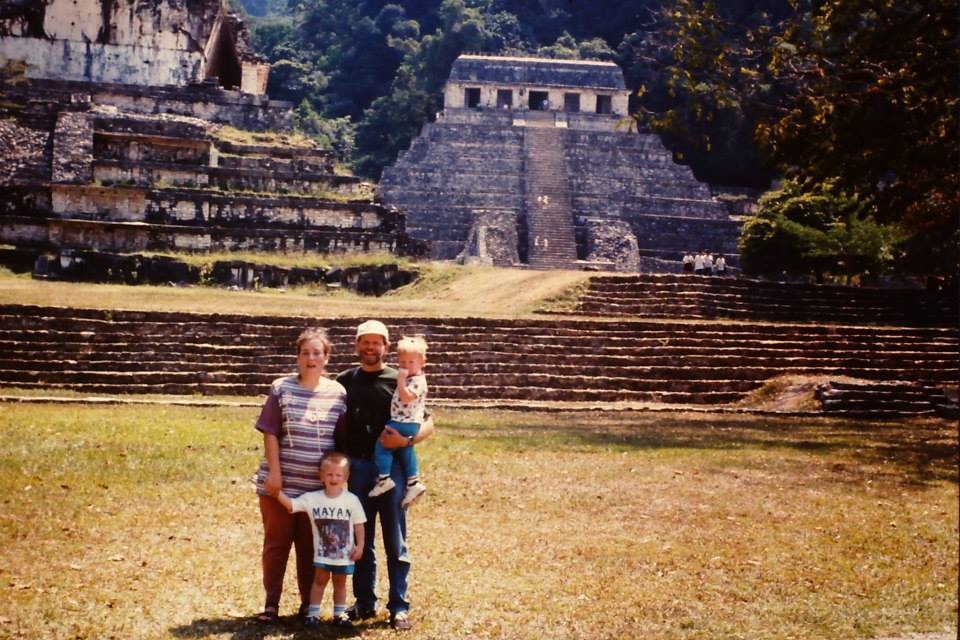
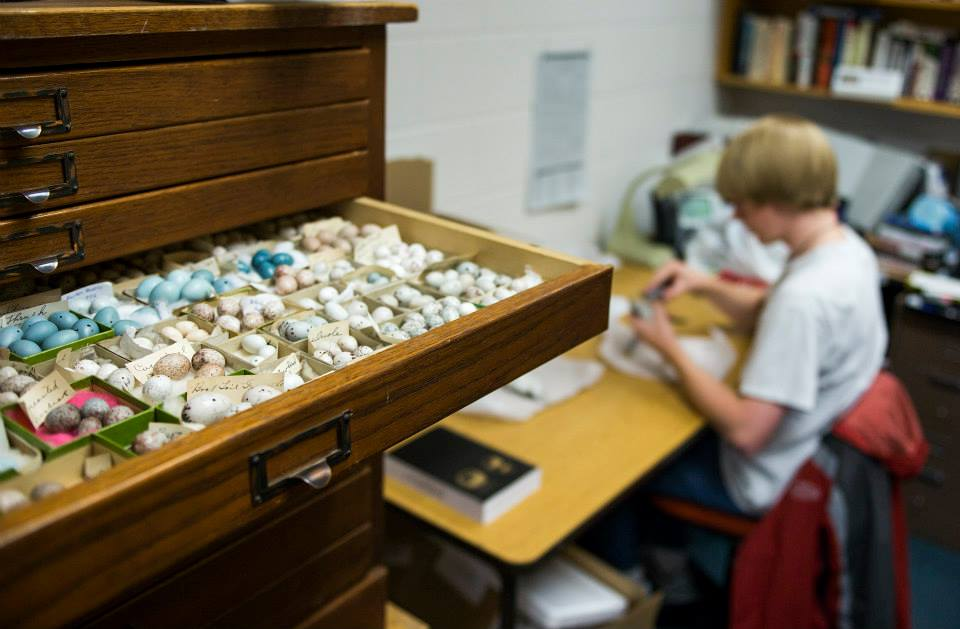
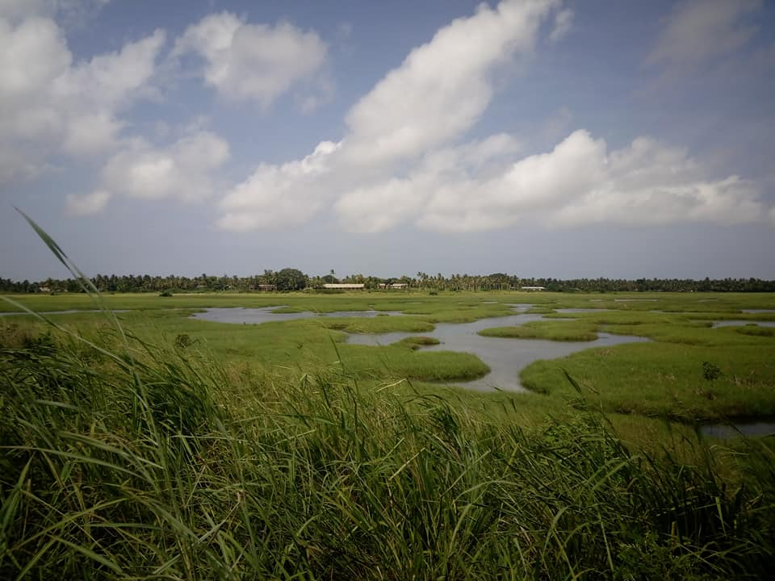
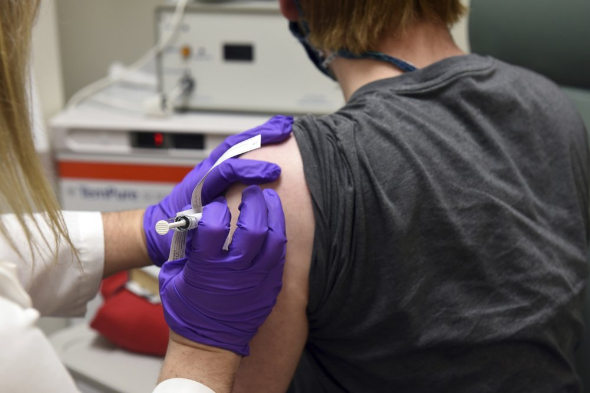
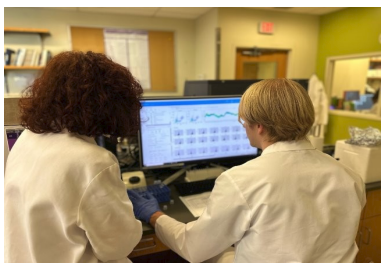
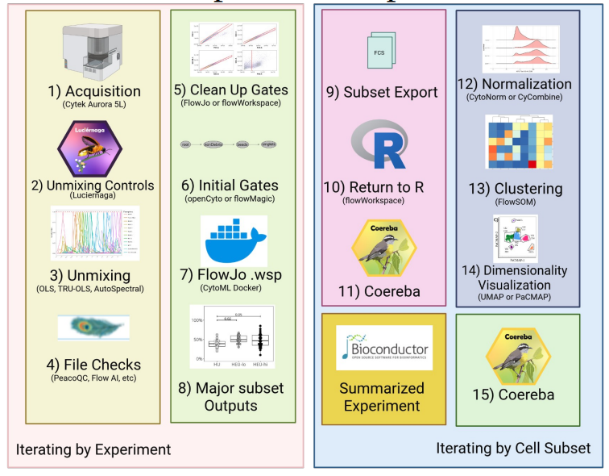
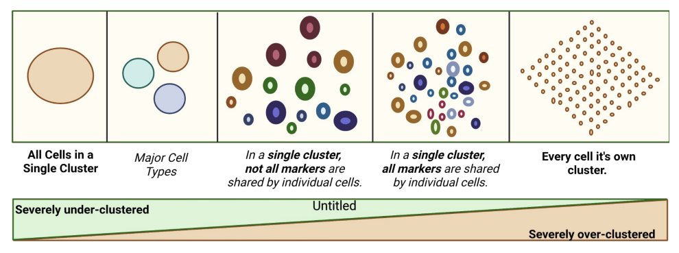

```{css, echo = FALSE}
.justify{
  text-align: center
}
```

::: justify
### So where are you from?
:::

<p>

</p>

:::::::: columns
::: {.column width="4%"}
:::

::: {.column width="35%"}
{width="95%"}
:::

::: {.column width="2%"}
:::

::: {.column width="55%"}
Growing up as a [Third Culture Kid](https://www.nytimes.com/2020/09/11/t-magazine/luca-guadagnino-third-culture-kids.html?unlocked_article_code=gmcO6aItnbYg-KmwHkfF8V49bsFJUEw_TG4zMswnK6wfzIPWwdVQCigYDCQotX6SwgskywRMfIjReydmC_AgY5CXrYdDTdu-zpL9pjXpmyCFXNRqSYUGQD89Q-TpWgVdKExEBfq6RL8FjfZv2pbS6OYWdJylnwMqCaltK3D1v2GB0OhmrQLaFWP79LeDntEnmcM02jGZBOKQp4QdrP2NVTYmdR1bMJxX8bKPZAgYg_NQcJTgTK6nqKJpgLmdliWD4gbtdOYDQ5hVYlGgSfG2OSdjkqaKJ9RwweS-h6zHMj8DdBHckjMG46hnz6JBGMgE-gmUh3dC9pYWhjCnKiK4QZ83jK70Zxd7KqFEvmsZgg&smid=url-share%22), "Where are you from?" is a question I always hated. The simple concise answers that the majority of my peers would provide when introductions were being made inevitably detoured down a rabbit-hole when it was my turn to introduce myself.

My family, originally from southwest Michigan, USA moved to Chiapas, Mexico for work when I was two. I learned to read and write in Spanish long before I did in English; my childhood memories include birding around the [local](https://ebird.org/hotspot/L688365?yr=all&m=&sortBy=spp) Mayan ruins on the weekends; and the only time in my life I had ever been to Cancun was after a grueling 22 hour bus ride through the mountains so that I could take my SAT exam for the US university admissions process, as it was the closest testing site.
:::

::: {.column width="4%"}
:::
::::::::

<br></br>

:::::::: columns

::: {.column width="4%"}
:::

::: {.column width="55%"}
I moved back to the US for university when I was 17. I graduated from [Northwest College](https://nwc.edu/), receiving my A.S in Natural Resources Biology. It was during my time in Powell, Wyoming that thanks to undergraduate research opportunities through [INBRE](http://www.uwyo.edu/wyominginbre/) working with Dr. [Eric C. Atkinson](https://nwc.edu/directory/faculty-staff/atkinson-eric.html) that I first became interested in Microbiology. After Northwest, I transferred to the [University of Wyoming](http://www.uwyo.edu/) where I received a B.S. in Molecular Biology and Microbiology, and got my first taste of immunology researching [Natural Killer](/publications.qmd) cell responses in mice to secondary *Toxoplasma gondii* infection in the lab of Dr. [Jason Gigley](http://www.uwyo.edu/molecbio/faculty-and-staff/jason-gigley/index.html).
:::

::: {.column width="2%"}
:::

::: {.column width="35%"}
{width="95%"}
:::

::: {.column width="4%"}
:::

::::::::

<br></br>

:::::::: columns
::: {.column width="4%"}
:::

::: {.column width="35%"}
{width="95%"}
:::

::: {.column width="2%"}
:::

::: {.column width="55%"}
<br></br> After university, I served in the [Peace Corps](https://www.peacecorps.gov/) as a Secondary Science Teacher in [Ghana](https://en.wikipedia.org/wiki/Ghana) from 2016-2018. I taught biology and chemistry at a rural high school in the Volta Region. During my time in Ghana, I worked on secondary projects focused on Malaria that led to my decision to enter a Microbiology and Immunology PhD program.
:::

::: {.column width="4%"}
:::

::::::::

<br></br>

:::::::: columns

::: {.column width="4%"}
:::

::: {.column width="55%"}
<br></br> I moved to Baltimore for my PhD in 2018, before starting my thesis research under the supervision of Drs. [Cristiana Cairo](https://www.medschool.umaryland.edu/profiles/Cairo-Cristiana/) and [Kirsten Lyke](https://www.medschool.umaryland.edu/profiles/Lyke-Kirsten/). After passing my qualifying exam, COVID-19 happened, and everything paused. While stuck at home, I volunteered for the Pfizer Phase I clinical trial taking place at the [University of Maryland Center for Vaccine Development](https://www.medschool.umaryland.edu/cvd/trials/) and somehow ended up having family and friends telling me they saw my arm in the newspaper for the next nine [months](https://wjla.com/news/local/university-of-maryland-covid-trial-vaccine-recipient-success-indicators).

:::

::: {.column width="2%"}
:::

::: {.column width="35%"}
{width="95%"}
:::

::::::::

::: {.column width="4%"}
:::

<br></br> 

:::::::: columns

::: {.column width="4%"}
:::

::: {.column width="35%"}
{width="95%"}
:::

::: {.column width="2%"}
:::

::: {.column width="55%"}
My PhD research was focused on understanding the impact that prenatal exposure to maternal viral load and antiretrovirals has on the functional responses of [Innate-like](/publications.qmd) and Adaptive T cells of HIV-exposed Uninfected Infants at birth and during early life. Our lab was an early adopter of spectral flow cytometry (SFC) as COVID-19 clinical samples reduced availability to the mass cytometers on campus. Through trial-and-error, we re-discovered that you can't treat spectral flow cytometry like a conventional flow cytometry and just throw compensation at unmixing errors to fix the problem. Thanks to community-shared best practices from the [University of Chicago](https://www.youtube.com/@UChicagoFlow), we got back on track to good unmixing and building larger panels. 
:::

::: {.column width="4%"}
:::

::::::::

<br></br>  

:::::::: columns

::: {.column width="4%"}
:::

::: {.column width="35%"}
<br></br>
<br> </br>
I had become interested in unsupervised analysis, but quickly realized existing software struggled with SFC datasets due to the number of acquired cells, and unmixing errors that introduced batch effects. While chasing down a second autofluorescence signature in our panel, I ended up teaching myself over R over the course of the following year. After discovering [Bioconductor](https://www.bioconductor.org/), I began branching into [software development](/software.qmd) to address the areas where our current analysis struggles. 
:::

::: {.column width="2%"}
:::

::: {.column width="55%"}
{width="95%"}
:::

::: {.column width="4%"}
:::

::::::::

<br></br>  

:::::::: columns

::: {.column width="4%"}
:::

::: {.column width="35%"}
{width="95%"}
:::

::: {.column width="2%"}
:::

::: {.column width="55%"}

<br> </br>
Ultimately, what good is any tool if the community isn't able to use it? Realizing learning R was a barrier to entry for high-dimensional cytometry analysis, I created our free virtual [Cytometry in R](https://umgcccfcsr.github.io/CytometryInR/course/) course to hopefylly spare future graduate students having to learn the hard way as I had. 
:::

::: {.column width="4%"}
:::

::::::::

<br></br> 

:::::::: columns

::: {.column width="4%"}
:::

::: {.column width="35%"}
Having defended my Thesis, I am currently working at the UMGCCC Flow Cytometry Shared Resource. When not implementing automated dashboards, or figuring out how to automatically screen all acquired unmixing controls for tandem degradation, I am working to push spectral flow cytometry to its technical limits, while developing the software tools needed to enable it to achieve its full biological discovery potential. 
:::

::: {.column width="2%"}
:::

::: {.column width="55%"}
{width="95%"}
:::

::: {.column width="4%"}
:::

::::::::