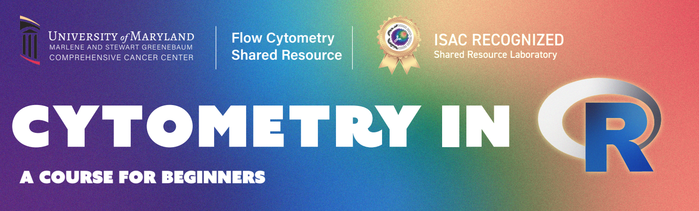

  

:::::::: columns

::: {.column width="3%"}
:::

::: {.column width="45%"}
  

:::

::: {.column width="5%"}
:::

::: {.column width="45%"}
[Cytometry in R](https://umgcccfcsr.github.io/CytometryInR/course/) is a free virtual weekly course for those with flow cytometry knowledge, but no-to-little coding experience. Builds gradually covering introductory coding skills before moving to more advanced topics. Received favorable community reviews, with 2000 email signups, and over 650 documented participants worldwide. 
:::

::: {.column width="2%"}
:::

::::::::

  

