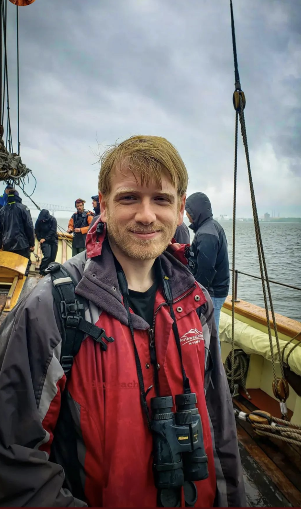

:::::::: columns

::: {.column width="5%"}
:::

::: {.column width="30%"}

:::

::: {.column width="5%"}
:::

::: {.column width="55%"}

I am a research scientist, computational biologist and cytomery enthusiast, specializing in high-parameter spectral flow cytometry, from panel design through unsupervised analysis. 

My research interest lie at the intersection of high-dimensional cytometry, computational biology, and statistics. I seek to push spectral flow cytometry to its technological limits, while developing [software tools](/software.qmd) to enable it to realize its full biological discovery potential. I advocate for open-source and open-science, and have a passion for [teaching](/courses.qmd) and training others. 

I am currently a research fellow at the University of Maryland Greenebaum Comprehensive Cancer Center Flow Cytometry Shared Resource under the supervision of [Dr. Xiaoxuan Fan](https://www.medschool.umaryland.edu/profiles/xiaoxuan-fan/). I received my Ph.D. from the University of Maryland, Baltimore under the supervision of  Drs. [Cristiana Cairo](https://www.medschool.umaryland.edu/profiles/Cairo-Cristiana/) and [Kirsten Lyke.](https://www.medschool.umaryland.edu/profiles/Lyke-Kirsten/). My thesis project focused on understanding the impact that prenatal exposure to maternal viral load and antiretrovirals has on [Innate-like](/publications.qmd) and Adaptive T cells of HIV-exposed Uninfected Infants at birth and during early life.

When not in lab (or thinking about autofluorescence), I enjoy birding, trail running, kayaking, coffee, learning new languages and have occasionally had a plant survive my summer gardening attempts.

:::

::: {.column width="5%"}
:::
::::::::
