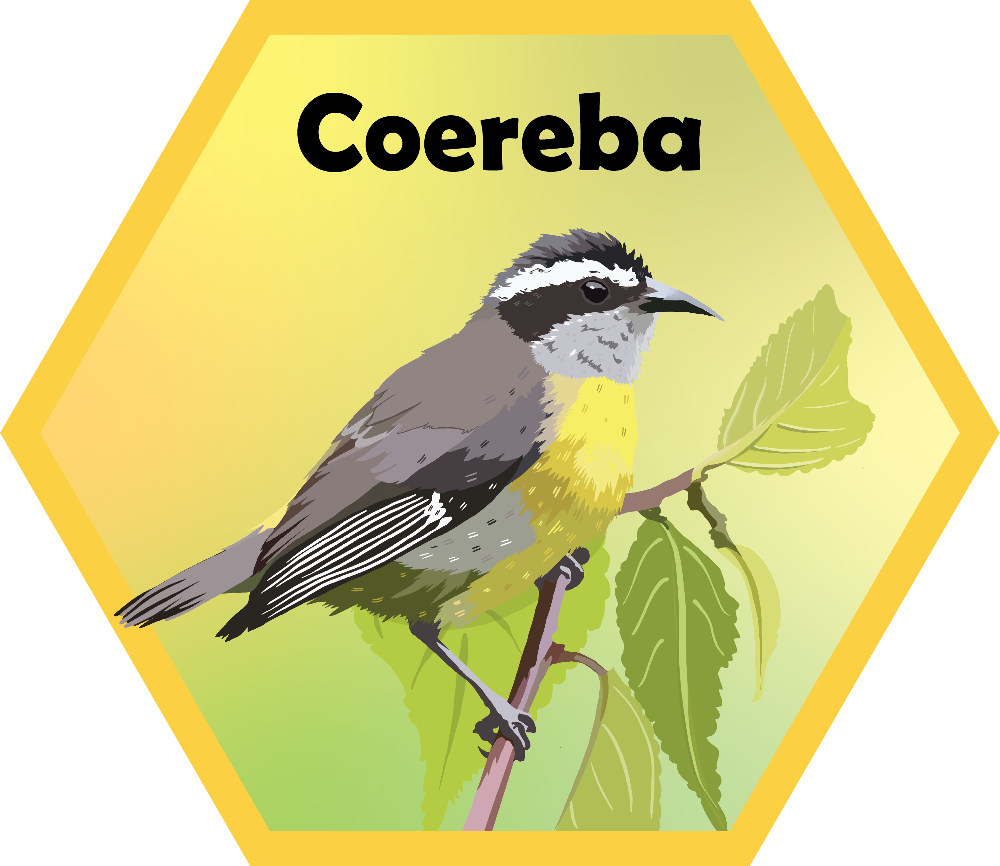
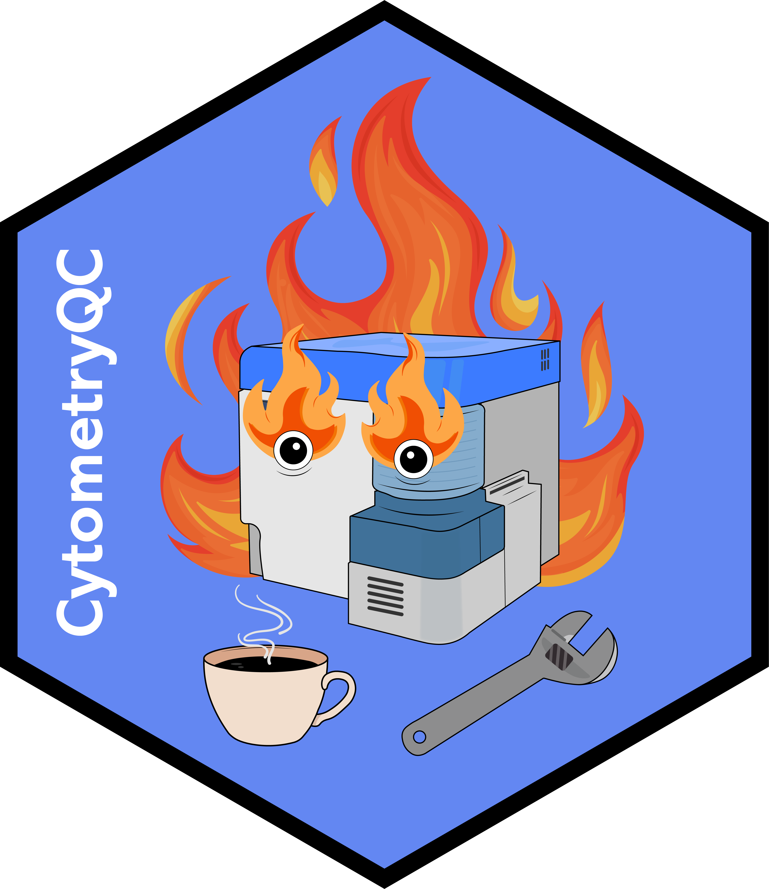

### Luciernaga

:::::::: columns

::: {.column width="65%"}
  
[Luciernaga](https://github.com/DavidRach/Luciernaga) characterizes normalized fluorescent signatures from individual cells in raw.fcs files, groups on basis shared peaks of similar heights, returns as individual .fcs files. Enables screening unmixing controls for tandem degradation and isolation heterogenous autofluorescence.
:::

::: {.column width="35%"}

:::

::::::::

### Coereba

:::::::: columns

::: {.column width="35%"}

:::

::: {.column width="65%"}
  
[Coereba](https://github.com/DavidRach/Coereba) permits annotation of individual cells in unmixed .fcs files with manual-style gating information (implemented via automated gating and Shiny app). Ties into Bioconductor ecosystem for downstream statistics, while also allowing retrieval of performance data for unsupervised algorithms. 
:::

::::::::

#### CytometryQC

:::::::: columns

::: {.column width="65%"}
  
  
We implemented an automated dashboard framework enabling UMGCCC Flow Core to monitor instrument QC status for all instruments. Subsequently extended to allow monitoring all acquired unmixing controls and samples acquired at facility for quality control issues. On-going work to implement as the [CytometryQC](https://github.com/DavidRach/CytometryQC) package for easier setup for different instrument manufacturers.
:::

::: {.column width="35%"}

:::

::::::::